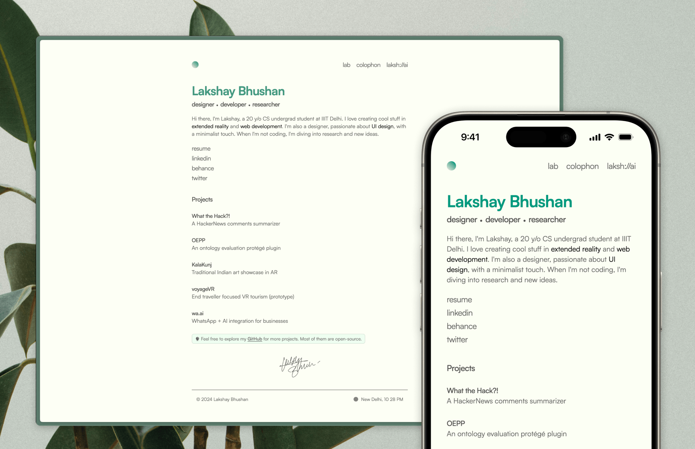

<h1 align="center">lakshb.dev</h1>

<p align="center">


</p>

<a href="https://lakshb.dev" target="_blank" rel="noreferrer noopenner">

</a>

Hi, I'm Lakshay and this is my super minimal yet feature-rich personal website [lakshb.dev](https://lakshb.dev)

## General Info

- **Astro**: Built with Astro.
- **React**: Built with React.
- **TypeScript**: Written in TypeScript.
- **MDX**: Used for writing blog posts (Lab) with interactive react elements.
- **Groq AI**: Used for `laksh:\\ai` (Lakshay's AI persona).
- **TursoDB**: Used for storing personal information for AI.
- **Drizzle ORM**: Used for fetching data from TursoDB.
- **Spotify API**: Used for fetching now playing song.
- **Tailwind CSS**: Styled with Tailwind CSS.
- **Framer Motion**: Animated with Framer Motion.
- **Prettier**: Formatted with Prettier.
- **PostHog**: Used for web analytics.
- **Vercel**: Deployed with Vercel.

## Features

- Highly Performant. — [PageSpeed Insights](https://pagespeed.web.dev/analysis/https-lakshb-dev/6g4k4nzoba?form_factor=mobile)
- Minimal & Responsive Design with Tailwind CSS.
- Static Site Generation with Astro.
- Interactive Blog Posts with MDX.
- Personal AI Assistant `laksh:\\ai` with Groq AI.
- Spotify Now Playing Integration.
- View Transitions API for smooth page transitions.
- Framer Motion for micro-interactions.
- Astro Fonts for optimized fonts loading.
- Astro Image Component for optimized images.
- Subtle Light Color Theme that doesn't hurt your eyes.
- Shows current time in the footer with hand-made svg's showing time of the day.
- SEO Optimized with OpenGraph, Twitter Meta Tags and Robots.txt.
- Custom 404 Page with a cute illustration.
- PostHog & Vercel Analytics for web analytics.

## Project Structure

```bash
.
├── public
│   ├── docs
│   ├── fonts
│   ├── icons
│   ├── ...svgs
│   └── og.png
├── src
│   ├── assets
│   ├── components
│   ├── constants
│   ├── content
│   ├── db
│   ├── layouts
│   ├── migrations
│   ├── pages
│   └── utils
├── .env
├── .gitignore
├── .prettierignore
├── .prettierrc
├── astro.config.mjs
├── bun.lockb
├── drizzle.config.ts
├── LICENSE
├── package.json
├── README.md
├── tailwind.config.mjs
└── tsconfig.json
```

## Development Setup

1. Clone the repository.

```bash
git clone https://github.com/lakshaybhushan/lakshb.dev.git
```

2. This project uses `bun` as package manager. Install the dependencies using:

```bash
bun install
```

3. Start the development server using:

```bash
bun run dev
```

4. Open [http://localhost:4321](http://localhost:4321) to view it in the browser.

## Env Variables

```
- SITE: Your Deployed Site URL.
- SPOTIFY_CLIENT_ID: Spotify Client ID.
- SPOTIFY_CLIENT_SECRET: Spotify Client Secret.
- SPOTIFY_REFRESH_TOKEN: Spotify Refresh Token.
- GROQ_API_KEY: Groq API Key.
- TURSO_CONNECTION_URL: TursoDB Connection URL.
- TURSO_AUTH_TOKEN: TursoDB Auth Token.
- UPLOAD_SECRET: Secret for uploading/updating text file to TursoDB. Can be anything you like.
```

## License

This project is licensed under the MIT License - see the [LICENSE](LICENSE) file for details.
